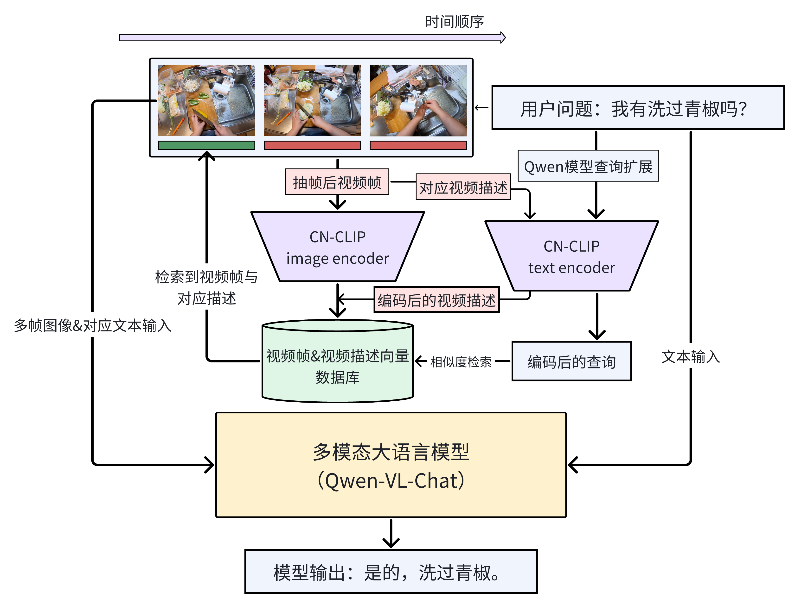
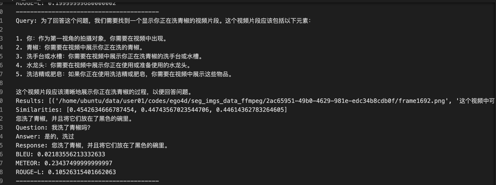

# VideoRAG
本项目探索针对长视频对话的RAG系统，旨在实现第一人称视角下的长视频问答，实现辅助记忆效果。

# 整体工作流程

## TODO
1. 扩展数据库到支持图片（存储以及混合模态查询，基于Chinese-CLIP）✅
2. 测试基于视频抽帧的RAG效果(基于Qwen-VL) ✅
3. 视频连续帧描述生成与绑定 ✅
4. 查询扩展 ✅
5. 查询扩展的消融实验
6. 更大模型（Qwen-VL-Plus和Max的测试，更大上下文embedding模型的替换）
7. 声音支持 

## reference projects
1. TinyRAG
2. LlamaIndex
3. Chinese CLIP  
~~4. Qwen-VL (huggingface-cli download --resume-download --local-dir-use-symlinks False Qwen/Qwen-VL --local-dir ./Qwen-VL)~~
4. Qwen-VL-Chat

## env preparation
conda env create -n video_rag python=3.9.18  
conda activate video_rag  
pip install -r requirements.txt
### Qwen-VL-Chat:
pip install transformers_stream_generator  
pip install accelerate

## launch
1. 视频帧分割 用ffmpeg
2. 向量数据库建立  
python test_upload.py
3. 查询与答案生成

## 效果
